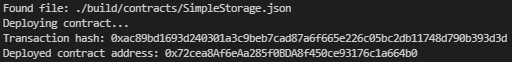

# 2 - Deploy A Simple Ethereum Smart Contract On Polyjuice

1. Console Output

2. Transaction Hash - 0xac89bd1693d240301a3c9beb7cad87a6f665e226c05bc2db11748d790b393d3d

3. Contract Address - 0x72cea8Af6eAa285f0BDA8f450ce93176c1a664b0
