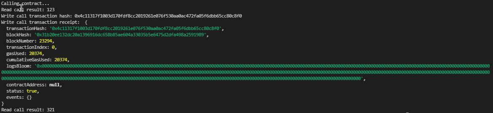

# 3 - Issue A Smart Contract Call To The Deployed Smart Contract

1. Smart contract call console output



2. Transaction Hash - 0x4c11317f1003d170fdf8cc2019261e076f530aa0ac472fa05f6dbb65cc80c8f0

3. Contract Address - 0x72cea8Af6eAa285f0BDA8f450ce93176c1a664b0

4. Contract ABI:

```
[
  {
    "inputs": [],
    "stateMutability": "payable",
    "type": "constructor"
  },
  {
    "inputs": [
      {
        "internalType": "uint256",
        "name": "x",
        "type": "uint256"
      }
    ],
    "name": "set",
    "outputs": [],
    "stateMutability": "payable",
    "type": "function"
  },
  {
    "inputs": [],
    "name": "get",
    "outputs": [
      {
        "internalType": "uint256",
        "name": "",
        "type": "uint256"
      }
    ],
    "stateMutability": "view",
    "type": "function"
  }
]
```
