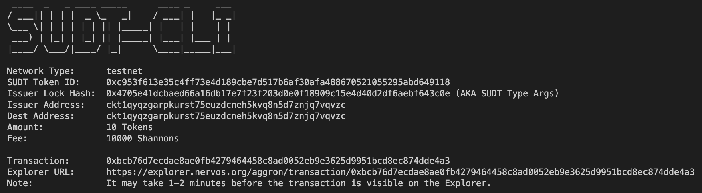
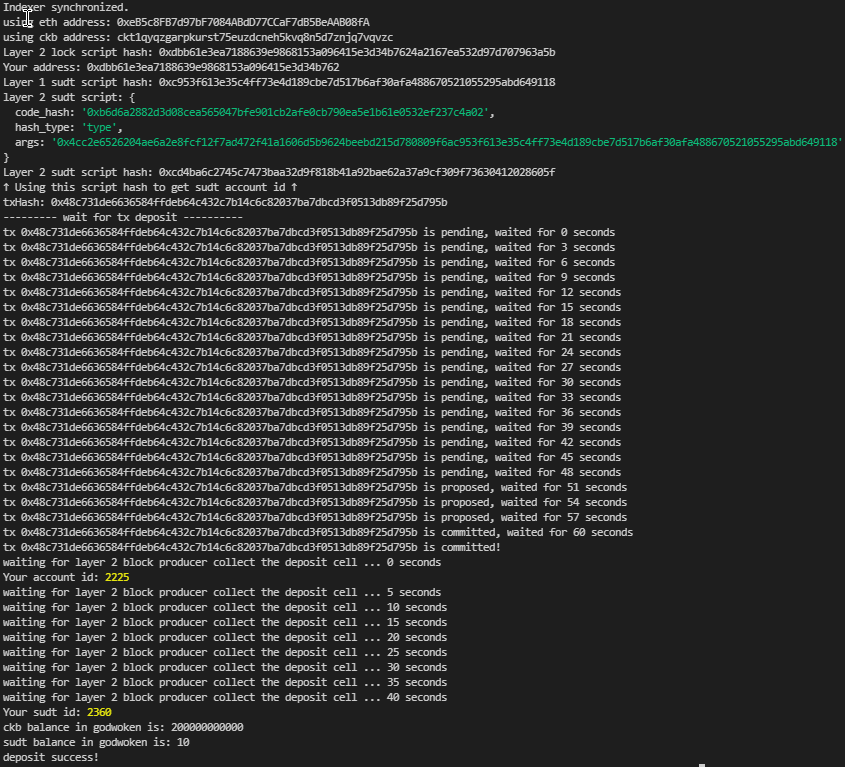

# 4 - Issue An SUDT Token On Layer 1 And Deposit It To Layer 2

1. Layer 1 Address Link - [Click Here](https://explorer.nervos.org/aggron/address/ckt1qyqzgarpkurst75euzdcneh5kvq8n5d7znjq7vqvzc)

2. SUDT token creation

3. Transaction ID - [Click Here](https://explorer.nervos.org/aggron/transaction/0xbcb76d7ecdae8ae0fb4279464458c8ad0052eb9e3625d9951bcd8ec874dde4a3)

4. SUDT token deposit layer 2

5. SUDT ID - 2360
