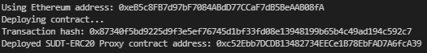
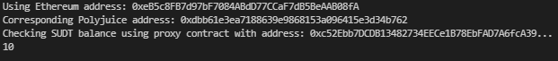

# 5 - Deploy The ERC20 Proxy Contract For The Deposited SUDT

1. Deploy proxy contract

2. Proxy contract address -

3. Check sudt balance

4. Ethereum address - 0xeB5c8FB7d97bF7084ABdD77CCaF7dB5BeAAB08fA
