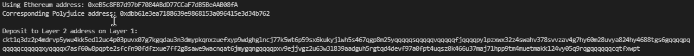

# 6 - Use Force Bridge To Deposit Tokens From Ethereum To Polyjuice

1. Deposit receiver address

2. Deposit receiver address - ckt1q3dz2p4mdrvp5ywu4kk5edl2uc4p03puvx07g7kgqdau3n3dmypkqnxzuefxyp9wdghglncj77k5wt6p59sx6kukyjlwh5s467qgp8m25yqqqqqsqqqqqvqqqqqfjqqqqpylpzxwx32z4swahv378svvzav4g7hy60m28uvya824hy4688tgs6gqqqqpqqqqqqcqqqqqxyqqqqx7asf60w8pqpte2sfcfn90fdfzxue7ff2g8sawe9wacnqat6jmygqngqqqqpxv9ejjvgz2u63w3l839aadguh5rgtqd4devf97a0fpt4uqsz0k466u37maj7lhpp9tm4muetmakkl24vy05q9rqgqqqqqqcqtfxwpt

3. Ethereum address - 0xeB5c8FB7d97bF7084ABdD77CCaF7dB5BeAAB08fA

4. Etherescan explorer link - [Click Here](https://rinkeby.etherscan.io/tx/0x7b612d307b579634c33145cb529a330b403a18183db53b030a55bbc91ba8aa34)

5. Nervos explorer link - [Click Here](https://explorer.nervos.org/aggron/transaction/0xedfdbb22ad80d62511d36af7b348c1dc096b555e54e89a3f7f86f22eed0710ef)
